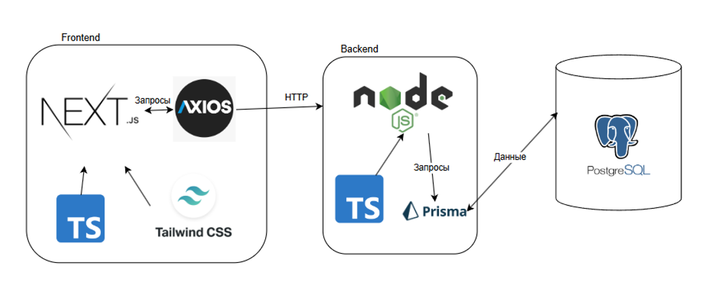

# Проект WokNextJS
Этот проект представляет собой веб-приложение, разработанное с использованием Next.js, который объединяет возможности React с серверным рендерингом и генерацией статических сайтов.

### Установка и запуск
Для установки и запуска проекта необходимо выполнить следующие шаги:

1. Установить Node.js и npm, если они еще не установлены на вашем компьютере.
2. Склонировать репозиторий проекта на ваш компьютер `git clone https://github.com/katyatya/WokNextJS`.
3. Открыть терминал и перейти в папку с проектом `cd WokNextJS`.
4. Установить зависимости проекта с помощью команды `npm install`.
5. Запустить проект в режиме разработки командой `npm run dev`.
6. После выполнения этих команд вы сможете открыть ваш браузер и перейти по адресу `http://localhost:3000` для доступа к приложению.

### Сборка и деплой
Для сборки проекта для продакшн:

1. Выполните команду `npm run build` для создания оптимизированной сборки.
2. Для запуска собранного проекта выполните `npm run start`.

### Структура проекта
```
WokNextJS/ 
├── @types
├── README.md
├── app
│   ├── (checkout)
│   ├── (dashboard)
│   ├── (root)
│   ├── actions.ts
│   ├── api
│   │   ├── auth
│   │   ├── cart
│   │   ├── checkout
│   │   ├── ingredients
│   │   ├── products
│   │   ├── stories
│   │   └── users
│   ├── fonts
│   ├── globals.css
│   └── layout.tsx
├── prisma
├── public
│   ├── assets
│   │   └── images
│   └── noodle.png
├── services
│   ├── api-client.ts
│   ├── auth.ts
│   ├── axios-instance.ts
│   ├── cart.ts
│   ├── constants.ts
│   ├── dto
│   │   └── cart.dto.ts
│   ├── ingredients.ts
│   ├── products.ts
│   └── stories.ts
├── shared
│   ├── components
│   │   ├── modals
│   │   │   ├── auth-modal
│   │   │   ├── choose-product-modal.tsx
│   │   │   └── index.tsx
│   │   ├── shared
│   │   └── ui
│   ├── constans
│   ├── hooks
│   ├── lib
│   └── store
├── tailwind.config.ts
└── tsconfig.json
```

* @types/ содержит TypeScript декларации для расширения типов Next-auth, Prisma и YooKassa.
* app/ содержит основные компоненты и роуты Next.js приложения, организованные по группам маршрутов.
    * (checkout)/ содержит страницы и компоненты, связанные с оформлением заказа.
    * (dashboard)/ содержит административные страницы и панель управления.
    * (root)/ содержит основные публичные страницы сайта, включая модальные окна и страницы продуктов.
    * api/ содержит серверные API роуты, организованные по функциональности (auth, cart, checkout и т.д.).
    * actions.ts содержит серверные экшены Next.js для вызова с клиента.
* prisma/ содержит schema.prisma для определения структуры базы данных и вспомогательные скрипты.
* public/ содержит статические ресурсы, включая изображения продуктов и иконки.
* services/ содержит сервисные функции для взаимодействия с API и бизнес-логику.
    * dto/ содержит типы данных для передачи объектов между клиентом и сервером.
* shared - содержит общие, переиспользуемые модули и ресурсы, которые используются в разных частях приложения
    * components/ содержит переиспользуемые UI компоненты, разделенные на категории.
    * components/modals/ содержит модальные окна, включая авторизацию и выбор продуктов.
    * components/shared/ содержит общие компоненты, используемые по всему приложению.
    * components/ui/ содержит базовые UI компоненты (кнопки, инпуты, диалоги).
    * constans/ содержит константы приложения, включая настройки авторизации.
    * hooks/ содержит кастомные React-хуки для управления состоянием и логикой.
    * lib/ содержит вспомогательные функции для работы с корзиной, платежами и прочей бизнес-логикой.
    * store/ содержит файлы для управления глобальным состоянием приложения.
* tailwind.config.ts содержит настройки Tailwind CSS для стилизации приложения.
* tsconfig.json содержит настройки TypeScript для проекта.

### Архитектура проекта


### Авторы
- Рядчикова Е.А.
- Неймойкина Е.В
- Зинаков Д.С.
- Бречко М.С